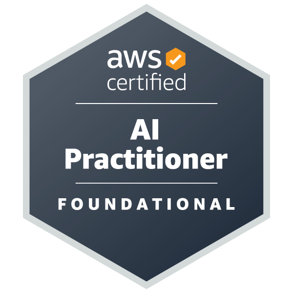

Data Engineer | Smart Cities | AWS Cloud

## About me

I'm a Data Engineer passionate about designing reliable cloud data platforms that transform mobility and urban data into actionable insights.
My experience combines Data Engineering, Cloud Architecture, GIS, and Transportation Systems, with a focus on building production-ready serverless solutions on AWS.
Outside of work, I teach university courses on Smart & Sustainable Cities, where I bridge engineering principles with emerging technologies and data-driven decision making.

## What I'm Working On
- Building serverless AWS data pipelines
- Developing mobility data platforms using GBFS & GTFS
- Geospatial analytics and spatial databases
- Studying for the AWS AI Practitioner certification
- Teaching Smart & Sustainable Cities

## Skills
Python | PostgreSQL | AWS | GIS | GTFS |GBFS | CDS | Data Pipelines

## AWS Certifications

<table align="center" border="0" width="90%">
  <tr>
    <td align="center" height="150">
      
       
      <b>AWS Certified Cloud Practitioner</b>
       
      ✅ Earned
    </td>
    <td align="center" height="150">
      
       
      <b>AWS Certified AI Practitioner</b>
       
      🚧 In Progress
    </td>
  </tr>
</table>

## Education

<b>Bachelor of Civil Engineering - Transportation Specialization </b>

---

## Featured Projects
- [GBFS Serverless Pipeline - CloufFormation Deployment](https://github.com/stefyperezg/serverless-mobility-data-pipeline)
- [Smart City Tools - Systems Analytics](https://github.com/stefyperezg/smart-cities-tools)

## Contact
- LinkedIn: [stefanny-perez](www.linkedin.com/in/stefanny-perez)
- Email: stefanny.perez.g1@gmail.com
